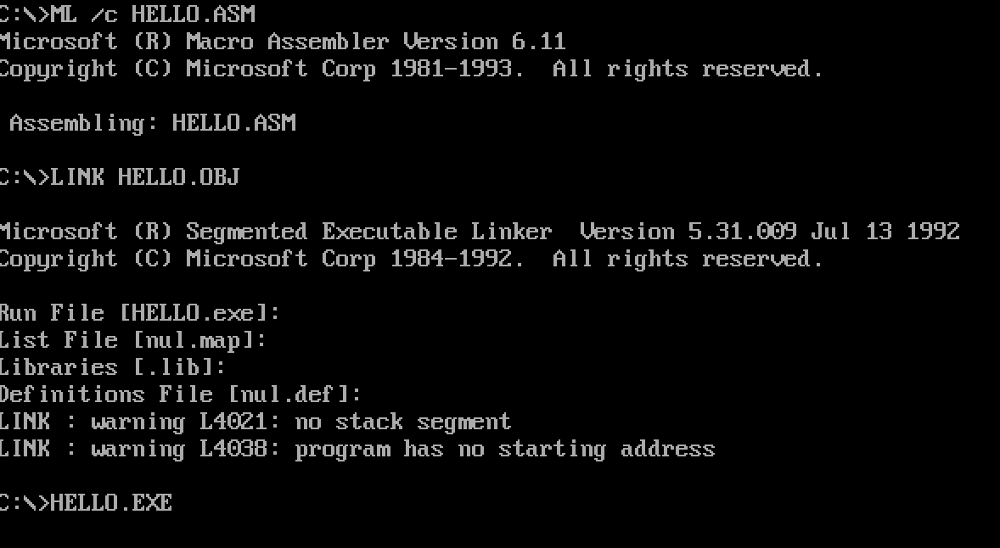

## Assembly codes

代码来自 《汇编语言 》第三版, 作者王爽老师, 查看完整代码请查阅 《汇编语言 》第三版

### 常用指令速查表

| 指令 | 格式 | 含义 | 示例 |
|------|------|------|------|
| `MOV` | `MOV 目标, 源` | 将源操作数传送到目标位置 | `MOV AX, BX` ; AX ← BX |
| `ADD` | `ADD 目标, 源` | 将源与目标相加，结果存回目标 | `ADD AX, BX` ; AX ← AX + BX |
| `SUB` | `SUB 目标, 源` | 从目标中减去源，结果存回目标 | `SUB AX, BX` ; AX ← AX - BX |
| `MUL` | `MUL 源` | 无符号乘法（AX/AL × 源） | `MUL BX` ; DX:AX ← AX × BX |
| `DIV` | `DIV 源` | 无符号除法（DX:AX ÷ 源） | `DIV BX` ; AX ← 商, DX ← 余数 |
| `INC` | `INC 操作数` | 操作数加1 | `INC CX` ; CX ← CX + 1 |
| `DEC` | `DEC 操作数` | 操作数减1 | `DEC CX` ; CX ← CX - 1 |
| `AND` | `AND 目标, 源` | 按位与运算 | `AND AL, 0Fh` ; 保留低4位 |
| `OR` | `OR 目标, 源` | 按位或运算 | `OR AL, 80h` ; 置高位置1 |
| `XOR` | `XOR 目标, 源` | 按位异或运算 | `XOR AX, AX` ; AX 清零 |
| `NOT` | `NOT 操作数` | 按位取反 | `NOT AL` |
| `SHL` | `SHL 操作数, 移位位数` | 逻辑左移（低位补0） | `SHL AX, 1` ; AX ← AX × 2 |
| `SHR` | `SHR 操作数, 移位位数` | 逻辑右移（高位补0） | `SHR AX, 1` ; AX ← AX ÷ 2 |
| `CMP` | `CMP 目标, 源` | 比较（目标 - 源，只影响标志位） | `CMP AX, BX` |
| `TEST` | `TEST 目标, 源` | 测试（按位与，只影响标志位） | `TEST AL, 80h` ; 测试最高位 |
| `JMP` | `JMP 标号` | 无条件转移 | `JMP NEXT` |
| `JE / JZ` | `JE 标号` | 相等/结果为0则转移（ZF=1） | `JE NEXT` |
| `JNE / JNZ` | `JNE 标号` | 不相等/结果不为0则转移（ZF=0） | `JNE NEXT` |
| `JB / JC` | `JB 标号` | 低于/进位为1则转移（CF=1） | `JB NEXT` |
| `JNB / JNC` | `JNB 标号` | 不低于/进位为0则转移（CF=0） | `JNB NEXT` |
| `JA` | `JA 标号` | 高于则转移（CF=0 且 ZF=0） | `JA NEXT` |
| `JBE` | `JBE 标号` | 低于或等于则转移（CF=1 或 ZF=1） | `JBE NEXT` |
| `JL` | `JL 标号` | 小于（有符号）则转移 | `JL NEXT` |
| `JNL / JGE` | `JNL 标号` | 不小于（有符号）则转移 | `JNL NEXT` |
| `JG` | `JG 标号` | 大于（有符号）则转移 | `JG NEXT` |
| `JNG / JLE` | `JNG 标号` | 不大于（有符号）则转移 | `JNG NEXT` |
| `LOOP` | `LOOP 标号` | 循环（CX ← CX - 1，CX≠0 则转移） | `LOOP AGAIN` |
| `CALL` | `CALL 标号/子程序` | 调用子程序（入栈返回地址） | `CALL SUBPROC` |
| `RET` | `RET` | 从子程序返回 | `RET` |
| `PUSH` | `PUSH 源` | 将操作数压入栈顶 | `PUSH AX` |
| `POP` | `POP 目标` | 从栈顶弹出数据到目标 | `POP AX` |
| `LEA` | `LEA 目标, 源地址` | 取有效地址（偏移地址） | `LEA DX, [BX+SI]` |
| `INT` | `INT 中断类型码` | 触发中断 | `INT 21h` ; DOS 系统调用 |
| `CLC` | `CLC` | 进位标志 CF ← 0 | `CLC` |
| `STC` | `STC` | 进位标志 CF ← 1 | `STC` |
| `CLD` | `CLD` | 方向标志 DF ← 0（正向） | `CLD` |
| `STD` | `STD` | 方向标志 DF ← 1（反向） | `STD` |
| `CLI` | `CLI` | 中断标志 IF ← 0（关中断） | `CLI` |
| `STI` | `STI` | 中断标志 IF ← 1（开中断） | `STI` |
| `NOP` | `NOP` | 空操作（CPU 空闲一个时钟周期） | `NOP` |

运行书中程序需要 `MASM`编译器. 下载地址: https://archive.org/details/masm611. 或者当前项目下的 `masm611.rar`解压

下载的里面比较全, 只用需要的挂在, 为了方便将 `DISK1/MK.EX$`, `DISK1/DECOMP.EXE`, `DISK1/BIN/DOSXNT.EX$` `DISK2/BIN/LINK.EX$` 放到和代码同级目录下.  

### 安装 MASM + DOSBox

1. 安装 `DOSBox`.

```bash
brew install --cask dosbox  # 安装的是 图形界面 App。
```

安装之后打开


2. 挂载 `MASM` 编译器

   将`masm611`目录下的程序挪到代码同级目录下.

```bash
# mount -u c  # 卸载挂载的目录.
mount c /Users/用户名/coding/assembly-codes
c:
DECOMP ML.EX$ ML.EXE
DECOMP LINK.EX$ LINK.EXE
DECOMP DOSXNT.EX$ DOSXNT.EXE
```

3. 编写程序. 回到 `DOSBox` 里面就能看到编写的ASM程序文件

4. 编译 + 运行

   ```BASH
   ML /c HELLO.ASM
   LKNK HELLO.OBJ
   HELLO.EXE

   # 成功如下图所示
   ```

   

5. 现在可以愉快的可以打开 IDEA 写汇编代码, 然后到 DOSBox 去编译写的汇编代码了.
